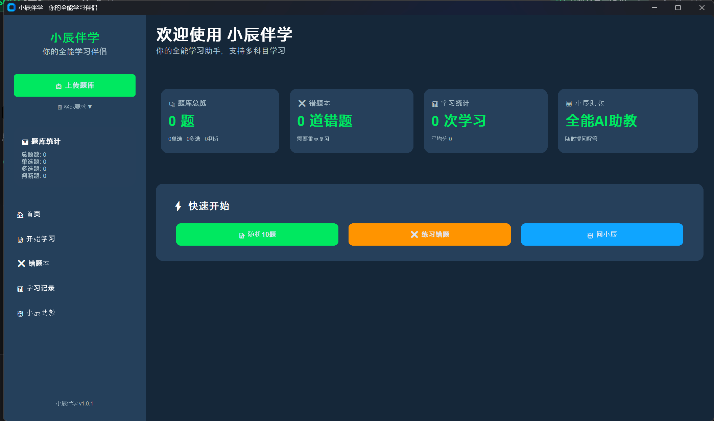

# 小辰伴学 · ShuaTi-toll

> 基于 Python + CustomTkinter 的桌面刷题学习工具，自带 AI 学习助教。

<p align="left">
  
  
  
</p>

## ✨ 功能特性

- **📚 自定义题库**：导入 UTF-8 编码的 JSON 题库，支持单选题、多选题、判断题
- **📝 智能组卷**：按专题、题型数量、学习时长自由配置；也可「随机 10 题」一键开练
- **❌ 错题本**：交卷后错题自动收录，支持按专题/题型筛选、单题练习、标记已掌握
- **📊 学习统计**：记录每次得分、正确率与用时，展示平均分、最高分与学习趋势
- **🤖 小辰助教**：内置多轮对话记忆（可新建/切换/删除会话），支持多家大模型服务：
  - 通义千问（DashScope）、智谱 AI、文心一言、DeepSeek、OpenAI，以及任意兼容 OpenAI 接口的自定义服务
  - 「简洁模式」让回答更短更直接

## 🖥️ 界面预览

应用采用深色主题 + 左侧导航栏，包含首页、学习配置、答题、结果、错题本、学习统计与 AI 助教七个页面。



## 🚀 快速开始

### 环境要求

- Python 3.9 及以上（开发环境为 Python 3.13）
- Windows / macOS / Linux（CustomTkinter 跨平台）

### 运行步骤

```bash
# 1. 克隆项目
git clone https://github.com/ZiChen-hub/ShuaTi-toll.git
cd ShuaTi-toll

# 2. 安装依赖
pip install -r requirements.txt

# 3. 启动程序
python main.py
```

启动后，将符合格式要求的 `题库.json` 放在程序目录下即可自动加载；也可点击左侧「📤 上传题库」手动选择文件。

## 📄 题库文件格式

题库是一个 **JSON 数组**，每道题为一个对象：

| 字段          | 类型             | 必填 | 说明                                          |
| ------------- | ---------------- | ---- | --------------------------------------------- |
| `id`          | string           | 是   | 题目唯一标识，如 `"q001"`                     |
| `content`     | string           | 是   | 题干内容                                      |
| `type`        | string           | 是   | `single`（单选）/ `multiple`（多选）/ `judge`（判断） |
| `options`     | string[]         | 是   | 选项列表，建议使用 `"A. 内容"` 格式           |
| `answer`      | string / string[] | 是   | 正确答案；多选为数组，如 `["A", "C"]`         |
| `explanation` | string           | 否   | 题目解析                                      |
| `category`   | string           | 否   | 专题分类，可用于组卷筛选                      |
| `subject`    | string           | 否   | 科目名称                                      |

示例：

```json
[
  {
    "id": "q001",
    "content": "Python 中哪个关键字用于定义函数？",
    "type": "single",
    "options": ["A. def", "B. func", "C. function", "D. define"],
    "answer": "A",
    "explanation": "def 是 Python 中定义函数的关键字。",
    "category": "Python基础"
  },
  {
    "id": "q002",
    "content": "以下哪些是 Python 的数据类型？",
    "type": "multiple",
    "options": ["A. int", "B. float", "C. str", "D. array"],
    "answer": ["A", "B", "C"],
    "explanation": "int、float、str 都是内置类型，array 不是。"
  },
  {
    "id": "q003",
    "content": "Python 是解释型语言。",
    "type": "judge",
    "options": ["A. 正确", "B. 错误"],
    "answer": "A"
  }
]
```

> 提示：文件必须为 UTF-8 编码；答案比较不区分大小写，但多选题必须与正确选项完全一致才算对。

## 🤖 AI 助教配置

1. 进入「🤖 小辰助教」页面，点击右侧「⚙️ 配置小辰助教」
2. 打开启用开关，选择模型提供商，填入 API Key（API 地址与模型名会自动填充，也可手动修改）
3. 保存后即可开始提问；对话记录保存在本地 `chat_memory.json`

## 📦 打包为可执行文件

Windows 下可直接双击 `package.bat` 一键打包（自动检查 PyInstaller、清理旧产物）；也可手动执行：

```bash
pyinstaller --noconfirm --clean xiaochenbanxue.spec
```

打包产物为单文件 `dist/小辰伴学.exe`，目标机器无需安装 Python 即可运行。

## 🗂️ 项目结构

```
ShuaTi-toll/
├── main.py                # 程序入口，ExamApp 应用中枢（考试流程编排、计时、批改）
├── config.py              # 全局配置：应用信息、配色、文件路径、模型提供商、AI 提示词
├── requirements.txt       # Python 依赖
├── package.bat            # Windows 一键打包脚本
├── xiaochenbanxue.spec    # PyInstaller 打包配置（单文件）
├── docs/                  # 界面截图
├── ai/                    # AI 助教模块
│   ├── ai_config.py       #   AI 配置读写（api_key / provider / model）
│   ├── ai_assistant.py    #   请求组装、API 调用与响应解析
│   └── chat_memory.py     #   多会话对话记忆（单例，持久化到本地）
├── database/              # 数据持久化层
│   ├── question_bank.py   #   题库加载、统计与随机抽题
│   └── wrong_bank.py      #   错题本增删改查
├── models/                # 数据模型
│   ├── question.py        #   题目模型
│   ├── exam_paper.py      #   试卷模型（作答收集、自动批改）
│   └── exam_record.py     #   学习记录模型
├── ui/                    # 界面层（CustomTkinter）
│   ├── main_window.py     #   主窗口：侧边栏 + 页面路由
│   ├── components.py      #   通用组件：渐变按钮、统计卡片、标题
│   ├── home_page.py       #   首页
│   ├── exam_config_page.py#   学习配置页
│   ├── exam_page.py       #   答题页
│   ├── result_page.py     #   结果页
│   ├── wrong_bank_page.py #   错题本页
│   ├── stats_page.py      #   学习统计页
│   └── ai_page.py         #   AI 助教页
└── utils/
    └── helpers.py         # 工具函数：ID 生成、JSON 安全读写、时间/文本格式化
```

## 📜 许可证

本项目基于 [MIT License](LICENSE) 开源。
